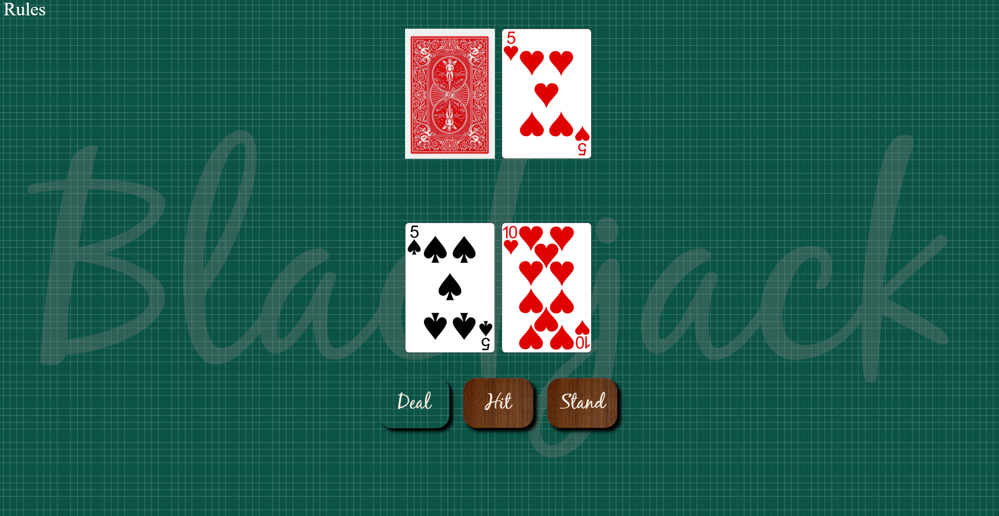

# Blackjack Game Project

## Technologies Used
- **Javascript**: Implement the logic of the game

- **CSS**: Styling 

- **HTML**: Game structure

## Game Rules

In Blackjack, everyone plays against the dealer. The goal is to get closer to 21 than the dealer without going over 21. If a hand goes over 21, it is called a “bust” or “break” and the wager is lost. Jacks, Queens and Kings count as 10. An Ace may be played as a 1 or an 11. All other cards are played at face value.

## Demo


In this game the player will have the option to deal, hit or stand. The deck will be created and shuffled when the player chooses to deal. When making this choice, the player and the dealer will be dealt two cards each. The player will get two cards facing up and the dealer will receive one faced up and the other faced down.



After choosing to deal, the 'Deal' button is disabled and the player will now have the the option to hit (get another card) or stand. If the player chooses to hit and his sum goes over 21, the dealer wins. If the player chooses to stand, the dealer's card is revealed and new cards will be added to the dealer's hand until it reaches a sum equal or greater than 17. Once this treshold is reached, the dealer's and player's hand sum will be compared and the winner will be declared based on the rules of the game.

The 'Deal' button is abled again after the winner is declared.


The rules of the game can be seen by hovering 'Rules' at the top left of the page. 


## Game Code Details

**HTML Structure**

```html
<body>
    <div class="rules-div">Rules</div>
    <div id="hands">
        <div id="playerhand"></div>
        <div id="dealerhand"></div>
    </div>
    <div id="gamebuttons">
        <button id="deal" class="buttons">Deal</button>
        <button id="hit" class="buttons">Hit</button>
        <button id="stand" class="buttons">Stand</button>
    </div>
    <p id="message"></p>
    <div class="title">Blackjack</div>
</body>
</html>
```

**Javascript**

Creating and shuffling the deck:

```js
function createDeck(){
    suits.forEach((suit) => {
        values.forEach((value)=> {
            deck.push(value + "-" + suit);
        });
    });
    
    for(let i=0; i< deck.length; i++){
        let shuffle = Math.floor(Math.random() * deck.length); 
        let temp = deck[i];
        deck[i] = deck[shuffle];
        deck[shuffle] = temp;
    };
}
```

Functions to get the value of the cards:

```js

function playerCardValue(card){
    let splitCard = card.split("-")
    let value = splitCard[0]
    
    if (isNaN(value)) {
        if (value === "A") {
            playerAceCount += 1
            return 11
        } else {
            return 10
        }
    }
    return parseInt(value)
}

function dealerCardValue(card){
    let splitCard = card.split("-")
    let value = splitCard[0]
    
    if (isNaN(value)) {
        if (value === "A") {
            dealerAceCount += 1
            return 11
        } else {
            return 10
        }
    }
    return parseInt(value)
}

```
Deal function:

```js
function deal(){
    playerHand = [];
    dealerHand = [];
    playerSum = 0;
    dealerSum = 0;
    playerAceCount = 0;
    dealerAceCount = 0;
    canDeal = true;
    canHit = false;
    canStand = false;
    message.innerText = "";

    if (canDeal === true){
        playerHandDiv.textContent = ""
        dealerHandDiv.textContent = ""

        playerCard1 = deck.pop(Math.floor(Math.random() * deck.length))
        playerCard2 = deck.pop(Math.floor(Math.random() * deck.length))
        dealerCard1 = deck.pop(Math.floor(Math.random() * deck.length))
        dealerCard2 = deck.pop(Math.floor(Math.random() * deck.length))

        cardImg1.src = "./Cards/" + playerCard1 + ".png"
        playerHandDiv.append(cardImg1)

        cardImg2.src = "./Cards/" + playerCard2 + ".png"
        playerHandDiv.append(cardImg2)

        Back.src = "./Cards/BACK.png"
        cardImg3.src = "./Cards/" + dealerCard1 + ".png"
        dealerHandDiv.appendChild(Back)

        Back.classList.add("back")
        cardImg3.classList.add("front")

        cardImg4.src = "./Cards/" + dealerCard2 + ".png"
        dealerHandDiv.append(cardImg4)

        playerSum += playerCardValue(playerCard1) + playerCardValue(playerCard2)
        dealerSum += dealerCardValue(dealerCard1) + dealerCardValue(dealerCard2) 

    if (playerSum === 22) {
        playerSum -= 10
        playerAceCount -= 1
    }

    if (dealerSum === 22) {
        dealerSum -= 10
        dealerAceCount -= 1
    }

    canHit = true
    canStand = true
    canDeal = false
    }
    dealbutton.disabled = true
}
```

Hit function:

```js
function hit(){
    if (canHit === true){

        hitCardPlayer = deck.pop(Math.floor(Math.random() * deck.length))
        playerSum += playerCardValue(hitCardPlayer)

        playerHand.push(hitCardPlayer)

        let cardImg = document.createElement("img")
        cardImg.src = "./Cards/" + hitCardPlayer + ".png"
        playerHandDiv.append(cardImg)

    if (playerSum > 21 && playerAceCount > 0) {
        playerSum -= 10
        playerAceCount -= 1
         canStand = true;
    } else if (playerSum > 21 && playerAceCount === 0){
        dealerHandDiv.replaceChild(cardImg3, Back)
        message.innerText = "Dealer wins!"
        canStand = false;
        canHit = false;
        canDeal = true;
        dealbutton.disabled = false
    }
    }else{
        return
    }
}
```
Stand function:
```js
function stand(){
    if (canStand === true){
        canHit = false
        dealerHandDiv.replaceChild(cardImg3, Back)
        if (dealerSum < 17){    
            do{
                hitCardDealer = deck.pop(Math.floor(Math.random() * deck.length))
                dealerSum += dealerCardValue(hitCardDealer)

                let cardImg = document.createElement("img")
                cardImg.src = "./Cards/" + hitCardDealer + ".png"
                dealerHandDiv.append(cardImg)
                splitCard = hitCardDealer.split("-")
                    
                if (hitCardDealer[0] === 'A' && dealerAceCount > 0){
                    dealerSum -= 10
                    dealerAceCount -= 1
                }
            }while (dealerSum < 17);
        }
                
        if (dealerSum > 21){
            message.innerText = "You win!"
            canDeal = true;
            dealbutton.disabled = false
        }else if (dealerSum > playerSum){
            message.innerText = "Dealer wins!"
            canDeal = true;
            dealbutton.disabled = false
        }else if (dealerSum < playerSum){
            message.innerText = "You win!"
            canDeal = true;
            dealbutton.disabled = false
        }else if(dealerSum === playerSum){
             message.innerText = "Tie!"
             canDeal = true;
             dealbutton.disabled = false
        }
    }
}
```
**CSS Styling**
```css

@import url('https://fonts.cdnfonts.com/css/black-jack');

body {
    display: flex;
    justify-content: center;
    align-items: center;
    background-color:#0B5345;
    height: 100vh;
    flex-direction: column;
    background-image: linear-gradient(#0B5345 2px, transparent 2px),
    linear-gradient(90deg, #0B5345 2px, transparent 2px),
    linear-gradient(rgba(255,255,255,.3) 1px, transparent 1px),
    linear-gradient(90deg, rgba(255,255,255,.3) 1px, transparent 1px);
    background-size: 100px 100px, 100px 100px, 20px 20px, 20px 20px;
    background-position:-2px -2px, -2px -2px, -1px -1px, -1px -1px;
}

#hands{
    display:flex;
    flex-direction:column-reverse;
    gap:180px;
}

#playerhand, #dealerhand{
    display:flex;
    margin: 5px;
    align-items: center;
    justify-content:center;
    flex-direction:row;
    gap:20px;
}

#playerhand img, #dealerhand img{
    height:25vh;
}

.buttons {
    height:150px;
    width:210px;
    font-size:60px;
    box-shadow: 10px 10px 10px black;
    border-radius: 40px;
    background: url('https://i.imgur.com/RzjoUEZ.jpeg');
    color:#f7ece1;
    font-family: 'BlackJack', sans-serif;
}

#gamebuttons {
    display:flex;
    justify-content:space-around;
    gap:40px;
    margin:70px;
}

p {
   font-size:65px;
   font-family: Helvetica;
   color:white;
}

button:disabled{
    background:transparent;
}

button:active {
    transform: scale(0.99); 
    box-shadow: 2px 2px 2px black;
}

.title{
    position:fixed;
    font-size: 800px;
    font-family: 'BlackJack', sans-serif;
    color:grey;
    opacity:0.3;
    z-index:-1;
    top:260px;
}

.rules-div {
position: absolute;
width:1200px;
color:white;
font-size:55px;
top:0px;
left:20px;
}
  
.rules-div::after {
content: "In Blackjack, everyone plays against the dealer. The goal is to get closer to 21 than the dealer without going over 21. If a hand goes over 21, it is called a “bust” or “break” and the wager is lost. Jacks, Queens and Kings count as 10. An Ace may be played as a 1 or an 11. All other cards are played at face value.";
position: absolute;
top: 100%;
left: 0;
visibility: hidden;
opacity: 0;
transition: opacity 0.3s ease;
}

.rules-div:hover::after {
visibility: visible;
opacity: 1;
}
```
## References

**Background**: https://projects.verou.me/css3patterns/#blueprint-grid

**Cards**: https://github.com/ImKennyYip/black-jack/tree/master/cards